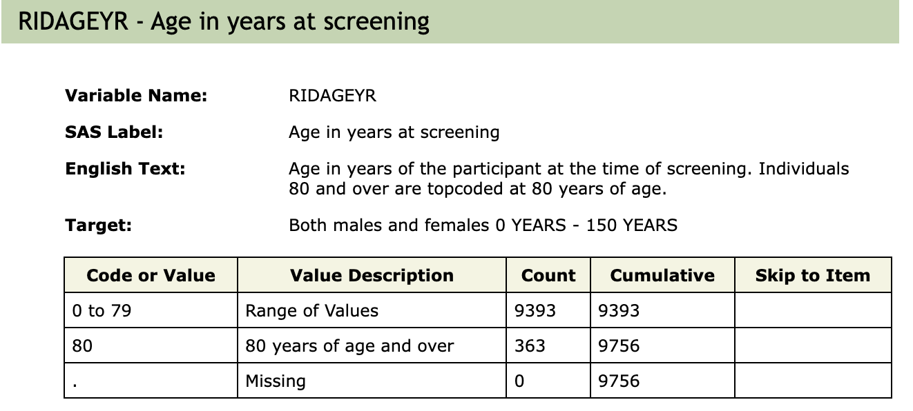
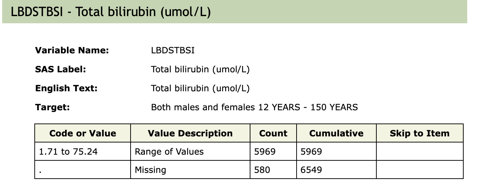

#  WQS R language tutorial

## [Association between manganese exposure in heavy metals mixtures and the prevalence of sarcopenia in US adults from NHANES 2011–2018](https://doi.org/10.1016/j.jhazmat.2023.133005)

数据库：NHANES 2011–2018

文章发表年份：2023

doi：https://doi.org/10.1016/j.jhazmat.2023.133005

### 研究内容

- sarcopenia 肌肉减少症
- Mn 锰暴露 血锰浓度
- logistic regression 评估血锰浓度和肌肉减少症的关联（感觉不是我教材需要讲解的）
- 采用**加权分位数和（WQS）模型**分析重金属混合物对肌少症患病风险的贡献，并确定锰的主要作用。

纳入排除流程图：

### 研究人群

​	In the NHNAES database from 2011 to 2018, we selected individuals aged 18 years or older who underwent heavy metals, body mass index (BMI), and dual-energy X-ray absorptiometry (DXA) measurements. Those who were under 18 years old (n = 15,331) or with missing data on heavy metals (n = 10,755), DXA (n = 6568), BMI (n = 22), or covariate data (n = 1440), white blood cell (n = 2), gamma glutamyl transferase (n = 77), bilirubin (n = 4) were excluded from the study. Finally, our study included 4957 participants, as shown in Fig. 1.

​	在 NHNAES 数据库中，2011 年至 2018 年，我们选择了 18 岁或以上接受重金属、体重指数 (BMI) 和双能 X 射线吸收测定法 (DXA) 测量的个体。年龄在 18 岁以下 (n = 15,331) 或缺少重金属 (n = 10,755)、DXA (n = 6568)、BMI (n = 22) 或协变量数据 (n = 1440)、白血球数据的人细胞 (n = 2)、γ 谷氨酰转移酶 (n = 77)、胆红素 (n = 4) 被排除在外 学习。最后，我们的研究包括 4957 名参与者。

### 数据收集

#### 重金属测量PBCD

Whole-blood specimens were kept at - 30 °C

数据测量：analyzed by inductively coupled plasma mass spectrometry

单位：

- [x] whole blood Pb  LBXBPB 0.25 µg/dL

- [x] whole blood Cd  LBXBCD 0.16 µg/L

- [x] whole blood Hg  LBXTHG 0.16 µg/L

- [x] whole blood Se  LBXBSE 30 ug/L

- [x] whole blood Mn  LBXBMN 1.06 ug/L

细节：

- [x] 清洗完数据之后记得统一单位！！！

#### Exclusion criteria：

​	measurement values below the limit of detection (LOD) were excluded

###### Detection Limits

​	The detection limit for all analytes was constant in the data set. The lower detection limits for lead were 0.25 µg/dL and 0.16 µg/L for cadmium, selenium was 30 ug/L, manganese was 1.06 ug/L, and 0.16 µg/L for total mercury.

### 疾病定义（Sarcopenia）

问卷获得

- [x] **Upper Body Lean Mass**（上肢瘦体重）
- [x] **Lower Body Lean Mass**（下肢瘦体重）
- [x] **BMXBMI**  BMX

DXAEXSTS – whole body scan examination status variable
1 = Whole body scan completed
2 = Whole body scan completed, but invalid
3 = Whole body not scanned, pregnancy
4 = Whole body not scanned, weight > 450 lbs
5 = Whole body not scanned, height > 6’5”
6 = Whole body not scanned, other reason

- [x] ASM定义文章

ASM was defined as the sum of muscle mass in both the arms and legs. For further details, see [Appendicular skeletal muscle mass: A more sensitive biomarker of disease severity than BMI in adults with mitochondrial diseases](https://journals.plos.org/plosone/article?id=10.1371/journal.pone.0219628).

**肌少症定义标准**
$$
ASMBMI = \frac{\text{四肢骨骼肌质量总和（kg）}}{\text{BMI}}
$$

$$
ASM = \text{DXDLALE} + \text{DXDRALE} + \text{DXDLLLE} + \text{DXDRLLE}
$$
​	1.	**根据ASMBMI标准（骨骼肌质量指数）**：

​	•	女性：**ASMBMI < 0.512**

​	•	男性：**ASMBMI < 0.789**

（ASMBMI指通过双能X射线吸收法（DXA）测得的骨骼肌质量除以体重指数（BMI））

#### Exclusion criteria：

​	pregnant, with a body weight > 136 kg, or with a height > 196 cm were excluded

​	**孕妇**	**体重 > 136 kg的个体**	**身高 > 196 cm的个体**

#### 纳入的协变量

##### DEMO

- [x] 年龄（受访时的年龄）作连续型变量 RIDAGEYR

- [x] 性别  Male/Female  二分类变量 RIAGENDR

- [x] BMI  连续型变量  BMI是用到了两次 一次在协变量 一次在ASMBMI中

- [x] 教育水平  （Middle school or lower/High school/College or more）三分类 DMDEDUC2

  - [x] 将1和2变为1 将3变为2 将4和5变成3 对于拒绝回答和不知道的以及缺失的排除

  
- [x] 婚姻状况（Never married/Married/Other）三分类  DMDMARTL

  - [x] 1是1 5变2 其他变3 missing的排除

- [x] PIR家庭贫困收入比  连续型变量  INDFMPIR

##### lifestyle 

- [x] drinking status（Yes/No）"Have you consumed a minimum of 12 alcoholic drinks per year?" ALQ101 and ALQ111 将2作为0 1作为1，其他排除

- [x] smoking status（Yes/No）based on the criterion of smoking at least 100 cigarettes during a person’s lifetime. SMQ020 1和2对换

- [x] sedentary （min）PAD680 排除其他异常数据

##### Medicine condition

- [x] Diabetes（Yes/No）DIQ010 1和2对换

- [x] Hypertension（Yes/No）BPQ020 1和2对换

Note:The continuous variables were presented as median (interquartile range, IQR), and the categorical variables were presented as number and percentages. BMI, body mass index; PIR, family poverty income ratio.

  

##### 补充（后续研究用到的，但是本研究不用）

BIOPRO 2013-2014的数据暂时无法下载

LBXWBCSI -- White blood cell count (1000 cells/uL) -- CBC_H

LBDSTBSI -- Total bilirubin (umol/L) -- BIOPRO_H 

LBXSGTSI -- Gamma glutamyl transferase (U/L) -- BIOPRO_H

### Statistical analyses

#### 描述性统计

- [x] 对于连续型变量，采用Kruskalallis秩和检验进行分析。
- [x] 对于计数类型的变量，对小于10的变量，采用Fisher确切概率检验。
- [x] 对于重金属浓度，以10为底进行log变换，转化后将浓度分为四分位数。
- [x] 相关性检验，使用Pearson相关分析检验5种重金属之间的相关性。

#### Logistic Regression

​	First, logistic regression analysis was conducted to investigate the single effect of heavy metals on the prevalence of sarcopenia. Three multivariate logistic regression analyses were conducted to adjust for different covariates. We designated the first quartile (Q1) as the control group. A linear trend analysis was conducted according to quartiles of heavy metals concentrations. 

​	The crude model did not adjust for any covariates. Model I adjusted for all covariates. Model II adjusted for all covariates and other heavy metals. Pb, lead; Cd, cadmium; Hg, mercury; Se, selenium; Mn, manganese; OR, odd ratio; CI, confidence interval.

#### WQS model

**重金属混合物的联合和单一影响：**

​	计算重金属混合物的加权线性指数，评估其对肌少症患病率的影响。

​	使用**bootstrap方法（迭代10,000次）**构建WQS指数，分别计算正向和负向影响。

**权重分析**：

​	当WQS指数显著时，检查各重金属的权重，识别对肌少症贡献最大的重金属。

**数据分配**：

​	随机将数据分为训练集（40%）和验证集（60%）。

### 复现结果

#### 数据纳入排除

- 18岁以下的人数： 15331 
- DMDEDUC2: 1238 
- DMDMARTL: 1208 
- INDFMPIR: 2528 
- LBXBPB: 7960 
- LBXBCD: 10472 
- LBXTHG: 7869 
- LBXBSE: 7682 
- LBXBMN: 7682 
- DXDLALE: 11009 
- DXDRALE: 11104 
- DXDLLLE: 11241 
- DXDRLLE: 11292 
- SMQ020: 324 
- PAD680: 168 
- DIQ010: 617 
- BPQ020: 29 
- BMXBMI: 1357 
- ALQ: 3103 
- ASM: 11998 
- ASMI: 12033 
- Sarcopenia: 12033 
- Rows with NA:  18812 
- remain nrow:  5013 

#### Kruskal-Wallis 检验

对连续型变量进行检验

============================================================
RIDAGEYR :

        Kruskal-Wallis rank sum test

data:  RIDAGEYR by Sarcopenia
Kruskal-Wallis chi-squared = 98.893, df = 1, p-value < 2.2e-16

============================================================
BMXBMI :

        Kruskal-Wallis rank sum test

data:  BMXBMI by Sarcopenia
Kruskal-Wallis chi-squared = 279.89, df = 1, p-value < 2.2e-16

============================================================
INDFMPIR :

        Kruskal-Wallis rank sum test

data:  INDFMPIR by Sarcopenia
Kruskal-Wallis chi-squared = 10.749, df = 1, p-value = 0.001043

============================================================
PAD680 :

        Kruskal-Wallis rank sum test

data:  PAD680 by Sarcopenia
Kruskal-Wallis chi-squared = 2.7964, df = 1, p-value = 0.09448

### 原文结果

